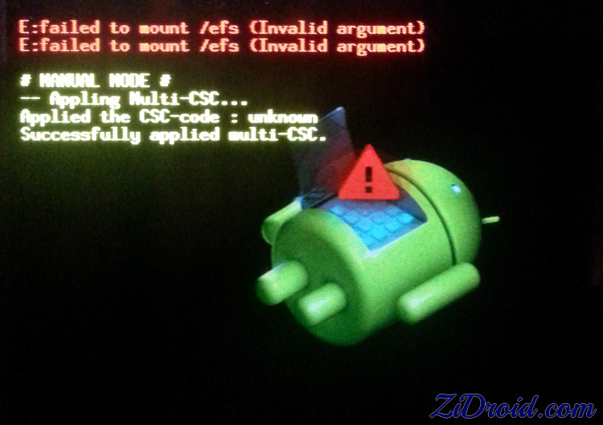

What is this tool?
==================
A script that attempts to extract nv_data from a 
partition image. 
The discussion below is applicable to the i9300 intl. GSM. 
However, it may be relevant to other devices as well.

When will it work?
==================
The script should work in the following cases
- You have accidentally formatted your EFS partition incorrectly, but haven't written
anything to it (for example, when it's been formatted through 
[https://play.google.com/store/apps/details?id=org.azasoft.free.swapper&hl=en](Swapper for Root)) and thus `corrupted`.
- You have a corrupted the EFS partition through some other means
- Possibly when the phone gets stuck during boot 
Corrupted EFS partition
--------------------------------
You know that the EFS partition has been corrupted when,
    - You are stuck and cannot boot into your ROM  (mine was stuck at the bootloader `Samsung i9300` when I had CyanogenMod installed)
    - If you're on stock, you are stuck at the Samsung ROM logo with a flashing blue indicator light 
    - and you should see the following error when you boot into the stock Samsung recovery:

>
> E:failed to mount /efs (Invalid argument)
>

What about 0049 or 0000 IMEI?
=============================
The script will not be of any help, since the device has already restored
its default EFS files. 

On what has it been tested?
===========================
I have only tested the tool on i9300 intl. (Samsung S3), GSM
with EFSv2. It may or may not work with EFSv1.

Script Reqirements
==================
- Ubuntu / Debian / other Linux operating system
- Python 2.7

Instructions
=============
0. Install a custom recovery, I used CWM (You can skip this step if you have already done so)
1. Make a full efs backup from a terminal emulator (I used [http://forum.xda-developers.com/showthread.php?t=1646108](AROMA)), 
> dd if=/dev/block/mmcblk0p3 of=/storage/sdcard1/efs_broken.img
2. Place partition backup on your computer
3. Format your EFS partition using a terminal emulator from recovery (Again, I used AROMA)
> mke2fs /dev/block/mmcblk0p3
4. Restart the phone, you should now be able to boot into your phone.
   Wait till you reach the homescreen then continue with the instructions
5. Boot back into recovery, then backup your EFS partion again.
This backup provides us with a working default which we shall use later.
> dd if=/dev/block/mmcblk0p3 of=/storage/sdcard1/efs_default.img
6. Copy over the EFS dumps to your computer 
7. Next, execute the following on your computer
> sudo python efs_recover.py efs_broken.img efs_default.img
8. If the execution was successful you should see updated_image_X.img files have been
generated. Where X is the number of the image.
9. Place the updated_image_x.img files on your sdcard
10. Reboot your phone into recovery and enter the terminal emulator (AROMA). Decide on an updated image to
use. Replace X with the number you choose
> dd if=/extSdcard/updated_image_X of=/dev/block/mmcblk0p3 of=/extSdcard/efs_broken.img
11. Reboot your phone, go into `About` and see if your IMEI was restored, if not, repeat steps 10 and 11 with a
different image.

References 
==========
I drew from the knowledge and effort of others in this project. The major contribution was an XDA forum
thread by *SlashV* [http://forum.xda-developers.com/galaxy-s3/help/successful-imei-repair-i9300-backup-t2544109](Successful IMEI repair on i9300 without backup.) 

- [http://forum.xda-developers.com/galaxy-s3/general/ref-imei-efs-stuff-i9300-including-t2393289]([REF] IMEI / EFS - Know this stuff (i9300) - including "no network")
- [https://github.com/ius/libsamsung-ipc](libsamsung-ipc Project for MD5 generation)
 
